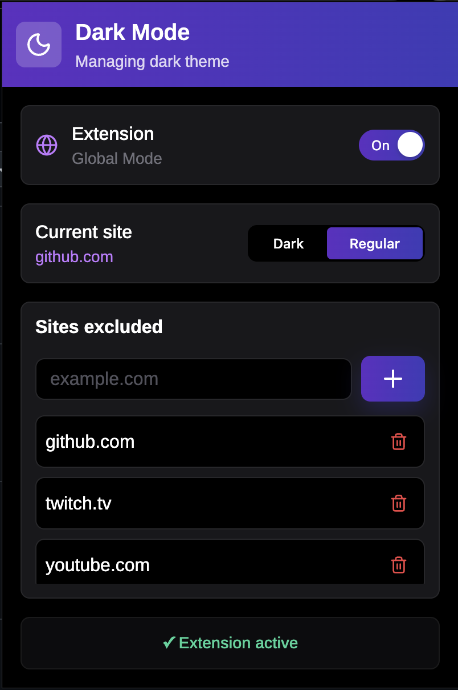

# Dark Mode Chrome Extension

A lightweight **Chrome Extension** that enables dark mode for websites with flexible per-site control. Built using **TypeScript** and **React**.

---

## Features

- Global toggle to enable/disable the extension
- Apply dark mode to specific websites
- Exclusion list for websites where dark mode should not be applied
- Add sites to the exclusion list via input field
- Remove sites from the list with a single click (trash icon)
- Instant updates without page reload (where possible)

---

## How It Works

- The extension injects custom styles into web pages to simulate a dark theme.
- A global switch controls whether the extension is active at all.
- Users can enable/disable dark mode per individual site.
- An exclusion list prevents styling on selected domains.
- All settings are stored locally using Chrome storage API.

---

## Tech Stack

- **TypeScript**
- **React**
- **Chrome Extensions API (Manifest V3)**
- **Local Storage / Chrome Storage**

---

## Installation

### 1. Clone repository
```bash
  git clone https://github.com/stenjeet/dark-mode-extension.git
  cd dark-mode-extension
```

### 2. Install dependencies
```bash
  npm install 
```

### 3. Build project
```bash
    npm run build
```

### 4. Load extension in Chrome
1. Open chrome://extensions/
2. Enable Developer mode (top right)
3. Click Load unpacked
4. Select the dist or build folder


#### If you don’t want to build the project manually, you can use a prebuilt version:

1. Go to the Releases section of this repository
2. Download the latest dark-mode-extension.zip
3. Unzip the archive
4. Open chrome://extensions/
5. Enable Developer mode
6. Click Load unpacked
7. Select the extracted dist folder

---

## Screenshots




---

## Contributing

1. Fork the project
2. Create a feature branch:

```bash
    git checkout -b feature/my-feature
```

3. Commit changes:

```bash
  git commit -m "Add my feature"
```

4. Push branch:

```bash
  git push origin feature/my-feature
```

5. Open a Pull Request

---


## Support

If you like this project, consider giving it a star on GitHub — it helps a lot!
